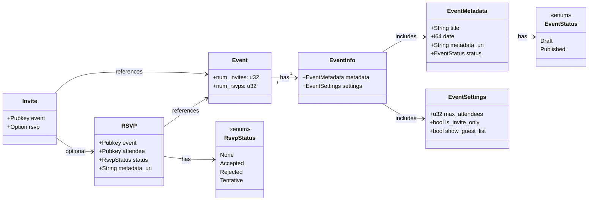

# Eventlink Solana Program

This folder was generated using the Anchor CLI. It contains the Solana program for the Eventlink project.

## Diagram

```mermaid
classDiagram
    direction LR

    %% === Accounts ===
    class Event {
        +num_invites: u32
        +num_rsvps: u32
    }

    class EventInfo {
        +EventMetadata metadata
        +EventSettings settings
    }

    class EventMetadata {
        +String title
        +i64 date
        +String metadata_uri
        +EventStatus status
    }

    class EventSettings {
        +u32 max_attendees
        +bool is_invite_only
        +bool show_guest_list
    }

    class Invite {
        +Pubkey event
        +Option<Pubkey> rsvp
    }

    class RSVP {
        +Pubkey event
        +Pubkey attendee
        +RsvpStatus status
        +String metadata_uri
    }

    %% === Enums ===
    class RsvpStatus {
        <<enum>>
        None
        Accepted
        Rejected
        Tentative
    }

    class EventStatus {
        <<enum>>
        Draft
        Published
    }

    %% === Relationships ===
    Event "1" --> "1" EventInfo : has
    EventInfo --> EventMetadata : includes
    EventInfo --> EventSettings : includes
    Invite --> Event : references
    RSVP --> Event : references
    Invite --> RSVP : optional
    RSVP --> RsvpStatus : has
    EventMetadata --> EventStatus : has
```
